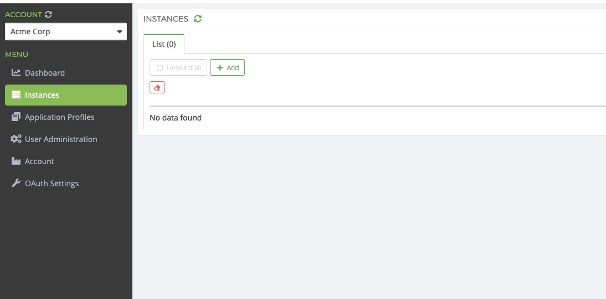
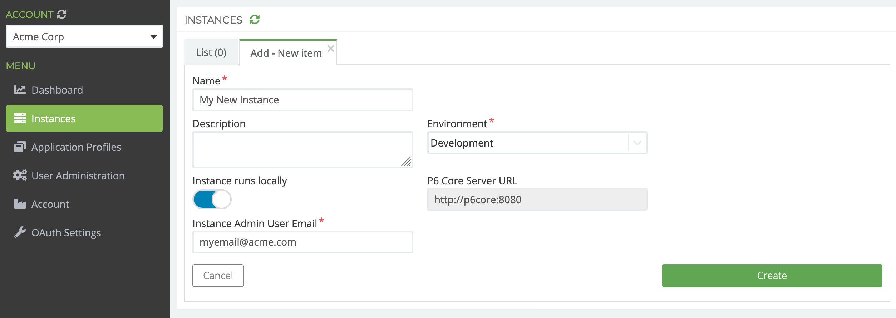
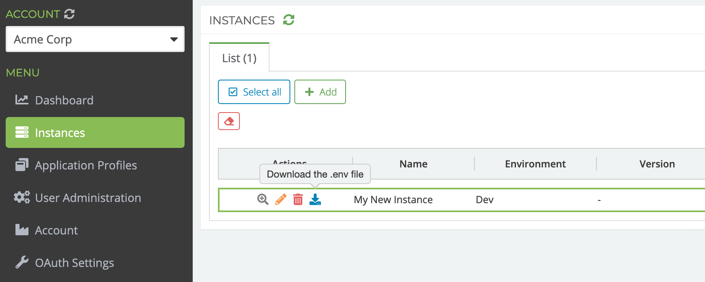
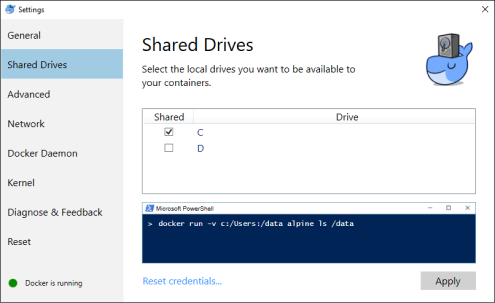

# Platform 6 Installation Using Docker

## Requirements

You need to install [Docker](https://www.docker.com/) on your machine: 
- OSX: https://docs.docker.com/docker-for-mac/
- Windows: https://docs.docker.com/docker-for-windows/
- Linux: https://docs.docker.com/engine/installation/

⚠️ Please download only the stable channel! We recommend using a version of Docker newer than:
- OSX: `18.03.1-ce-mac65`
- Windows: `18.03.1-ce-win65`

Configure Docker to use at least 2 CPUs, 4 GiB of memory and 1 GiB of swap.
You'll find in the __Getting Started__ page how to update your settings: 
- OSX: https://docs.docker.com/docker-for-mac/#memory.
- Windows: https://docs.docker.com/docker-for-windows/#advanced

The network ports used are:
- `2222`: SFTP port.
- `2221`: FTP port.
- `8080`: P6 instance HTTP API port.
- `8480`: Used by P6 Proxy to serve P6 Portal from a custom domain.

// TODO - rework from here down \/\/\/\/\/\/

## Docker Containers

The current installation of Platform 6 relies on [Docker Compose](https://docs.docker.com/compose/install/) to launch the following containers on a single host machine:
- _pgsql_: The database container used by P6 Core.
- _p6core_: The Platform 6 Core container where P6 applications run.
- _p6proxy_: This container is only required if you want to run the Platform 6 Portal locally. _You can safely delete it in production._
- _demobc_: A local Ethereum blockchain node used by the Demo App. _You can safely delete it in production._
- _demoexplorer_: A web UI to monitor the Demo blockchain. _You can safely delete it in production._


## Instructions

### Step 1

In your P6 Console account navigate to the _Instances_ menu. Then click the _Add_ button.



In the instance creation form, specify the following parameters:

* Name: Name of your instance.
* Description: Optional.
* Environment: You can change this at any time. The default value is _Development_. Please not that _Production_ instances
will eventually incur usage fees (but not before July 2020).
* Instance runs locally: Toggle this if you intend to run your instance locally on your machine, otherwise please fill in
the _P6 Core Server URL_ field with the URL (including port, default is 8080 unless you change it in 
[`docker-compose.yaml`](docker-compose.yaml) file).
* Instance Admin User Email: By default, this field is populated with your email address, so you would be declared as 
an admin of the newly declared instance. But you can choose otherwise and set another user account as the first admin
of the instance.



Finally, press the _Create_ button to create your instance.

### Step 2

Once Docker is running, clone the Git repository into a new directory dedicated to your local instance.

```
git clone https://github.com/amalto/platform6-install.git my-instance
cd my-instance
```

### Step 3

Download the `.env` file from your P6 Console interface, as you can see below:



Please note that depending on the browser and/or OS, the downloaded file may be named `.env` or a `env.txt` or simple `env`.

Place this file at the root of your instance directory, next to `.env.sample`, and __make sure the file is called `.env`__.
This name is required by Docker Compose, by convention this latter will read environment variables from this file.

Do not hesitate to edit this file to change the values of the variables to better suit your needs
(such as version, instance data location...).

__Windows__

Also, set the variable `PLATFORM6_ROOT` to the path where you wish to install your instance.

### Step 4

Run the script `provision_platform6.sh`/`provision_platform6.bat`.

It will clear the existing Platform 6 containers and volumes for your instance if any, before pulling the data needed for the initialisation of your instance.
When you run this script for the first time, it will try to delete a previous installation and throw errors because it cannot find any, therefore you can __safely ignore these errors__.

> ⏰ This step is normally performed once.

__OSX/Linux__

By default, it creates a folder called _platform6/instances_ in your _home_ directory (if not already present), where it creates another folder called after your instance id. This is where all your instance data resides. Hence, you can install multiple Platform 6 instances on the same physical machine.

However, you cannot run them at the same time, unless you modify port mapping in the [`docker-compose.yaml`](docker-compose.yaml) for some of your instances to avoid having multiple instances compete for the same port on the physical machine.

### Step 5

__Windows__

Share the local drive `C` with Docker using the __Shared Drives__ tab in the Docker settings menu.



### Step 6

Run the script `start_platform6.sh`/`start_platform6.bat`.

It will start the Platform 6 container.
Run the script `logs_platform6.sh`/`logs_platform6.bat` to see the logs of the instance.

### Step 7

To stop your Platform 6 instance, run the script `stop_platform6.sh`/`stop_platform6.bat`.

Once your instance is up and running, you can access the [Portal](http://localhost:8480/#/) with the credentials you use to access P6 Console.


## Update your instance's version

In case you receive a notification from Amalto for a new release of Platform 6, you are advised to upgrade the version of your Platform 6 instance.

For that, check that your instance is stopped, then:

* Pull the latest version of this repo.
* Set the `PLATFORM6_VERSION` and `P6CORE_IMAGE_ID` variables in the `.env` file to the desired version.
* Carefully read the [migration guide](https://documentation.amalto.com/platform6/latest/releases/migration/migration-troubleshooting/) for any additional steps to apply.
* Start your instance.


## Update your database version

The database version is specified in the `.env` file. If you would like to change it, follow these steps:

* First, export all your database data by running `db_export.sh` (Unix) / `db_export.bat` (Windows), while your database is still running with the old version. This will create a dump file in the `database_dumps` folder.
* Stop your instance by running `stop_platform6.sh` (Unix) / `stop_platform6.bat` (Windows).
* Set the variable `PGSQL_VERSION` in the `.env` file to the desired version, minimum version is 11.3.
* Run `db_import.sh` (Unix) / `db_import.bat` (Windows).
* Start your instance by running `start_platform6.sh` (Unix) / `start_platform6.bat` (Windows).


## Troubleshooting

__Windows__

Whenever Docker is a pain to mount your volumes on Windows, check this [very useful link](https://stackoverflow.com/questions/45972812/are-you-trying-to-mount-a-directory-onto-a-file-or-vice-versa), especially the answer that starts with _If you are using Docker for Windows..._


## Failover Mode

Platform 6 can run in failover mode, where 2 nodes (one active and one passive) are fired on top of the same database.
To see that working locally on your machine check out this [prototype](./cluster).

⚠️ Please not that this is only for demo purposes to understand how failover works, in production you would want to deploy
every P6 Core on a separate VM.
